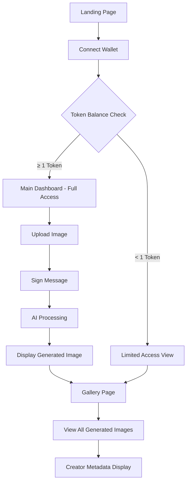

# Token-Gated AI Image Generation - Product Requirements Document

## 1. Product Overview

Transform the existing V-Sign photo editor into a token-gated AI image generation platform where users must hold a specific SPL token to access premium image generation features. The platform leverages Solana wallet authentication to verify token ownership and provides secure, AI-powered image generation capabilities.

- **Core Purpose**: Democratize AI image generation while creating token utility through exclusive access control, enabling creators to generate unique AI-enhanced images based on their token holdings.
- **Target Market**: Solana ecosystem participants, NFT creators, digital artists, and crypto-native users seeking exclusive AI-powered creative tools with verifiable ownership requirements.

## 2. Core Features

### 2.1 User Roles

| Role | Access Method | Core Permissions |
|------|---------------|------------------|
| Token Holder | Solana wallet connection + minimum 1 SPL token | Full access to AI image generation, gallery viewing, and image storage |
| Non-Token Holder | Solana wallet connection without required tokens | Limited to gallery viewing only, cannot generate images |
| Anonymous User | No wallet connection | Read-only access to public gallery |

### 2.2 Feature Module

Our token-gated AI image generation platform consists of the following main pages:

1. **Main Dashboard**: Wallet connection interface, token balance display, image upload component, and real-time generation results.
2. **Gallery Page**: Public showcase of all generated images with creator wallet addresses, filtering and sorting capabilities.
3. **Authentication Flow**: Wallet connection modal, token verification status, and signature verification process.

### 2.3 Page Details

| Page Name | Module Name | Feature description |
|-----------|-------------|---------------------|
| Main Dashboard | Wallet Connector | Connect Solana wallets (Phantom, Solflare, etc.), display connection status and wallet address |
| Main Dashboard | Token Gate Checker | Verify SPL token balance, display token requirements, show access status |
| Main Dashboard | Image Upload Zone | Drag-and-drop file upload, image preview, file validation and size limits |
| Main Dashboard | Generation Interface | Trigger AI processing, display loading states, show generated results instantly |
| Main Dashboard | Signature Verification | Generate unique messages for signing, verify wallet ownership through signatures |
| Gallery Page | Image Grid | Display all generated images in responsive masonry layout, show creation timestamps |
| Gallery Page | Creator Metadata | Display wallet addresses of image creators, link to creator's other works |
| Gallery Page | Filtering System | Sort by newest/oldest, filter by creator, search functionality |
| Authentication Flow | Wallet Selection | Present available wallet options, handle connection errors and retries |
| Authentication Flow | Token Verification | Real-time balance checking, display token requirements and current holdings |
| Authentication Flow | Access Control | Enable/disable features based on token ownership, show upgrade prompts |

## 3. Core Process

### Token Holder Flow:
1. User visits the main dashboard and clicks "Connect Wallet"
2. System presents wallet selection (Phantom, Solflare, etc.)
3. User connects wallet and system immediately checks SPL token balance
4. If balance ≥ 1 token, user gains access to image upload functionality
5. User uploads an image and signs a unique timestamped message
6. System verifies signature and re-checks token balance on server-side
7. AI processing begins and generated image is displayed upon completion
8. New record is created in database and image is stored in Supabase Storage
9. User can view their creation and all others in the gallery

### Non-Token Holder Flow:
1. User connects wallet but has insufficient token balance
2. System displays "You must hold at least 1 TOKE to use this feature" message
3. Upload functionality remains disabled with clear upgrade instructions
4. User can still browse the public gallery and view all generated images

## 4. User Interface Design

### 4.1 Design Style

- **Primary Colors**: Solana gradient (#9945FF to #14F195), deep space black (#0D0D0D)
- **Secondary Colors**: Electric purple (#8B5CF6), neon green (#10B981), warning amber (#F59E0B)
- **Button Style**: Rounded corners (8px), gradient backgrounds, subtle glow effects on hover
- **Typography**: Inter font family, 16px base size, bold weights for headings, medium for body text
- **Layout Style**: Card-based design with glassmorphism effects, top navigation with wallet status
- **Icons**: Lucide React icons with 24px standard size, crypto-themed wallet and token icons

### 4.2 Page Design Overview

| Page Name | Module Name | UI Elements |
|-----------|-------------|-------------|
| Main Dashboard | Wallet Connector | Gradient connect button, wallet status badge, address truncation with copy functionality |
| Main Dashboard | Token Gate Display | Token balance counter with animated numbers, progress bar for requirements, status indicators |
| Main Dashboard | Upload Zone | Dashed border drag area, file preview thumbnails, upload progress indicators |
| Main Dashboard | Generation Results | Full-width image display, before/after comparison slider, download and share buttons |
| Gallery Page | Image Grid | Responsive masonry layout, hover effects with creator info overlay, lazy loading |
| Gallery Page | Creator Cards | Wallet address with ENS resolution, creation timestamp, view count statistics |
| Authentication Flow | Wallet Modal | Centered modal with wallet logos, connection status animations, error state handling |

### 4.3 Responsiveness

Desktop-first design with mobile-adaptive breakpoints at 768px and 1024px. Touch interaction optimization for mobile wallet connections and image viewing. Gallery implements infinite scroll with touch-friendly navigation controls.

## 5. Security & Compliance

### 5.1 Authentication Security
- Signature verification using tweetnacl library for wallet ownership proof
- Server-side token balance re-verification to prevent client-side manipulation
- Timestamped nonce generation to prevent replay attacks

### 5.2 Data Protection
- Row Level Security (RLS) enabled on all database tables
- Secure file storage with public read access for generated images
- User wallet addresses stored securely with proper indexing

### 5.3 Rate Limiting
- Image generation limited to token holders only
- Server-side validation for all API requests
- Proper error handling for failed generations and network issues