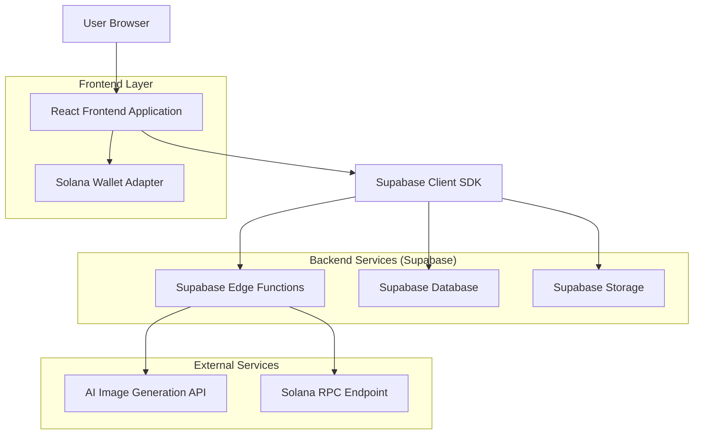
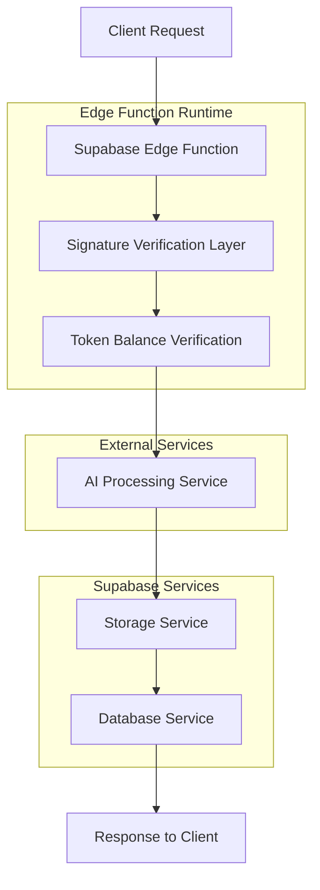
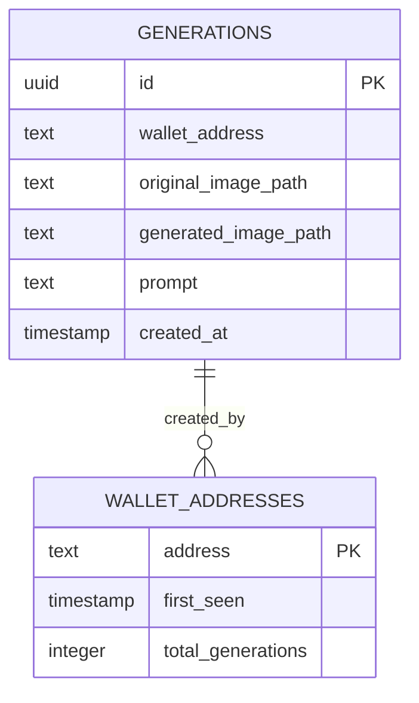

# Token-Gated AI Image Generation - Technical Architecture Document

## 1. Architecture Design



## 2. Technology Description

- **Frontend**: React@18 + TypeScript + Tailwind CSS + Vite
- **Wallet Integration**: @solana/wallet-adapter-react + @solana/web3.js
- **Backend**: Supabase (Database + Storage + Edge Functions)
- **Authentication**: Solana wallet signatures + SPL token verification
- **AI Processing**: External AI API integration via Edge Functions
- **Security**: tweetnacl for signature verification

## 3. Route Definitions

| Route | Purpose |
|-------|---------|
| / | Main dashboard with wallet connection and image generation interface |
| /gallery | Public gallery displaying all generated images with creator metadata |
| /auth | Wallet authentication flow and token verification status |

## 4. API Definitions

### 4.1 Core API

**Image Generation Endpoint**
```
POST /functions/v1/generate-image
```

Request:
| Param Name | Param Type | isRequired | Description |
|------------|------------|------------|-------------|
| wallet_address | string | true | User's Solana wallet public key |
| signature | string | true | Signed message proving wallet ownership |
| message | string | true | Original message that was signed |
| storage_path | string | true | Path to uploaded original image in Supabase Storage |

Response:
| Param Name | Param Type | Description |
|------------|------------|-------------|
| success | boolean | Operation success status |
| generated_image_url | string | Public URL of the generated image |
| generation_id | string | UUID of the generation record |
| error | string | Error message if operation failed |

Example Request:
```json
{
  "wallet_address": "7xKXtg2CW87d97TXJSDpbD5jBkheTqA83TZRuJosgAsU",
  "signature": "5K9...signature_bytes",
  "message": "Sign this message to prove wallet ownership: 1640995200000",
  "storage_path": "original_images/uuid-filename.jpg"
}
```

**Gallery Fetch Endpoint**
```
GET /rest/v1/generations
```

Response:
| Param Name | Param Type | Description |
|------------|------------|-------------|
| id | uuid | Generation record ID |
| wallet_address | string | Creator's wallet address |
| generated_image_path | string | Path to generated image |
| created_at | timestamp | Creation timestamp |

### 4.2 Solana Integration API

**Token Balance Check**
```typescript
interface TokenBalanceRequest {
  walletAddress: string;
  tokenMintAddress: string;
}

interface TokenBalanceResponse {
  balance: number;
  hasRequiredTokens: boolean;
}
```

**Message Signing**
```typescript
interface SignMessageRequest {
  message: string;
  walletAdapter: WalletAdapter;
}

interface SignMessageResponse {
  signature: Uint8Array;
  publicKey: PublicKey;
}
```

## 5. Server Architecture Diagram



## 6. Data Model

### 6.1 Data Model Definition



### 6.2 Data Definition Language

**Generations Table**
```sql
-- Create generations table for token-gated AI image generation
CREATE TABLE public.generations (
    id UUID PRIMARY KEY DEFAULT gen_random_uuid(),
    wallet_address TEXT NOT NULL,
    original_image_path TEXT NOT NULL,
    generated_image_path TEXT NOT NULL,
    prompt TEXT NOT NULL DEFAULT 'AI-enhanced image generation',
    created_at TIMESTAMP WITH TIME ZONE DEFAULT NOW()
);

-- Create indexes for performance
CREATE INDEX idx_generations_wallet_address ON public.generations(wallet_address);
CREATE INDEX idx_generations_created_at ON public.generations(created_at DESC);

-- Enable Row Level Security
ALTER TABLE public.generations ENABLE ROW LEVEL SECURITY;

-- RLS Policies
CREATE POLICY "Anyone can view generations" ON public.generations
    FOR SELECT USING (true);

CREATE POLICY "Only verified token holders can insert" ON public.generations
    FOR INSERT WITH CHECK (true); -- Verification handled in Edge Function

-- Create Supabase Storage bucket
INSERT INTO storage.buckets (id, name, public) 
VALUES ('generated_photos', 'generated_photos', true);

-- Storage policies
CREATE POLICY "Anyone can view generated photos" ON storage.objects
    FOR SELECT USING (bucket_id = 'generated_photos');

CREATE POLICY "Authenticated users can upload to generated photos" ON storage.objects
    FOR INSERT WITH CHECK (bucket_id = 'generated_photos');
```

**Edge Function: generate-image**
```typescript
// Supabase Edge Function implementation
import { serve } from 'https://deno.land/std@0.168.0/http/server.ts'
import { createClient } from 'https://esm.sh/@supabase/supabase-js@2'
import { verify } from 'https://esm.sh/tweetnacl@1.0.3'
import { Connection, PublicKey } from 'https://esm.sh/@solana/web3.js@1.87.6'

const corsHeaders = {
  'Access-Control-Allow-Origin': '*',
  'Access-Control-Allow-Headers': 'authorization, x-client-info, apikey, content-type',
}

serve(async (req) => {
  if (req.method === 'OPTIONS') {
    return new Response('ok', { headers: corsHeaders })
  }

  try {
    const { wallet_address, signature, message, storage_path } = await req.json()

    // 1. Verify signature
    const messageBytes = new TextEncoder().encode(message)
    const signatureBytes = new Uint8Array(signature.data || signature)
    const publicKeyBytes = new PublicKey(wallet_address).toBytes()
    
    const isValidSignature = verify(messageBytes, signatureBytes, publicKeyBytes)
    if (!isValidSignature) {
      throw new Error('Invalid signature')
    }

    // 2. Verify token balance
    const connection = new Connection(Deno.env.get('SOLANA_RPC_URL')!)
    const tokenMint = new PublicKey(Deno.env.get('TOKEN_MINT_ADDRESS')!)
    
    const tokenAccounts = await connection.getTokenAccountsByOwner(
      new PublicKey(wallet_address),
      { mint: tokenMint }
    )
    
    let tokenBalance = 0
    for (const account of tokenAccounts.value) {
      const accountInfo = await connection.getTokenAccountBalance(account.pubkey)
      tokenBalance += accountInfo.value.uiAmount || 0
    }
    
    if (tokenBalance < 1) {
      throw new Error('Insufficient token balance')
    }

    // 3. Process image with AI API
    const supabase = createClient(
      Deno.env.get('SUPABASE_URL')!,
      Deno.env.get('SUPABASE_SERVICE_ROLE_KEY')!
    )
    
    const { data: originalImage } = await supabase.storage
      .from('generated_photos')
      .download(storage_path)
    
    // Call AI API (placeholder)
    const aiResponse = await fetch(Deno.env.get('AI_API_ENDPOINT')!, {
      method: 'POST',
      headers: { 'Content-Type': 'application/json' },
      body: JSON.stringify({
        image: await originalImage.arrayBuffer(),
        prompt: 'AI-enhanced image generation'
      })
    })
    
    const generatedImageBuffer = await aiResponse.arrayBuffer()
    
    // 4. Save generated image
    const generatedImagePath = `generated/${Date.now()}-${wallet_address}.jpg`
    await supabase.storage
      .from('generated_photos')
      .upload(generatedImagePath, generatedImageBuffer)
    
    // 5. Create database record
    const { data: generation } = await supabase
      .from('generations')
      .insert({
        wallet_address,
        original_image_path: storage_path,
        generated_image_path: generatedImagePath,
        prompt: 'AI-enhanced image generation'
      })
      .select()
      .single()
    
    const { data: publicUrl } = supabase.storage
      .from('generated_photos')
      .getPublicUrl(generatedImagePath)
    
    return new Response(
      JSON.stringify({
        success: true,
        generated_image_url: publicUrl.publicUrl,
        generation_id: generation.id
      }),
      { headers: { ...corsHeaders, 'Content-Type': 'application/json' } }
    )
    
  } catch (error) {
    return new Response(
      JSON.stringify({ success: false, error: error.message }),
      { 
        status: 400,
        headers: { ...corsHeaders, 'Content-Type': 'application/json' }
      }
    )
  }
})
```

## 7. Required Dependencies

### Frontend Dependencies
```json
{
  "@solana/wallet-adapter-base": "^0.9.23",
  "@solana/wallet-adapter-react": "^0.15.35",
  "@solana/wallet-adapter-react-ui": "^0.9.35",
  "@solana/wallet-adapter-wallets": "^0.19.32",
  "@solana/web3.js": "^1.87.6",
  "@supabase/supabase-js": "^2.45.4"
}
```

### Edge Function Dependencies
```typescript
// Import map for Deno Edge Function
{
  "imports": {
    "tweetnacl": "https://esm.sh/tweetnacl@1.0.3",
    "@solana/web3.js": "https://esm.sh/@solana/web3.js@1.87.6",
    "@supabase/supabase-js": "https://esm.sh/@supabase/supabase-js@2"
  }
}
```

## 8. Environment Configuration

### Frontend Environment Variables
```env
VITE_SUPABASE_URL=your_supabase_project_url
VITE_SUPABASE_ANON_KEY=your_supabase_anon_key
VITE_TOKEN_MINT_ADDRESS=your_spl_token_mint_address
VITE_SOLANA_RPC_URL=https://api.mainnet-beta.solana.com
```

### Edge Function Environment Variables
```env
SUPABASE_URL=your_supabase_project_url
SUPABASE_SERVICE_ROLE_KEY=your_service_role_key
SOLANA_RPC_URL=https://api.mainnet-beta.solana.com
TOKEN_MINT_ADDRESS=your_spl_token_mint_address
AI_API_ENDPOINT=your_ai_image_generation_api_endpoint
```

## 9. Security Considerations

### 9.1 Client-Side Security
- Wallet adapter handles secure key management
- No private keys stored in browser
- Signature verification prevents unauthorized access

### 9.2 Server-Side Security
- Double verification of token balance (client + server)
- Signature validation using cryptographic verification
- RLS policies protect database access
- Service role key used only in secure Edge Functions

### 9.3 Data Protection
- Generated images stored in public bucket for gallery access
- Wallet addresses are public information by design
- No sensitive user data stored beyond wallet addresses