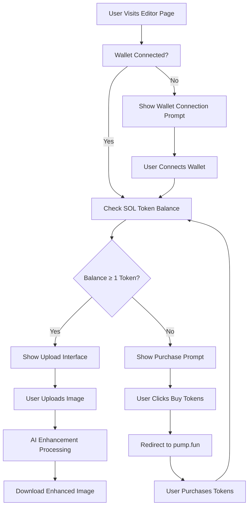

# Token-Gated Image Upload System - Product Requirements Document

## 1. Product Overview

A sophisticated token-gated image upload system that restricts access to AI-powered image enhancement features based on user's SOL token holdings. The system ensures only users with minimum 1 SOL token can access premium upload and enhancement capabilities, while providing clear pathways for token acquisition for non-qualified users.

The system addresses the need for monetized access control in AI image processing services, creating value for token holders while maintaining user experience standards. This feature targets crypto-native users who understand token-based access models and are willing to hold tokens for premium features.

## 2. Core Features

### 2.1 User Roles

| Role | Token Requirement | Core Permissions |
|------|-------------------|------------------|
| Token Holder | ≥1 SOL token | Full access to image upload, AI enhancement, download features |
| Non-Token Holder | 0 SOL tokens | View-only access, clear messaging about requirements, direct purchase links |

### 2.2 Feature Module

Our token-gated image upload system consists of the following main components:
1. **Token Verification Interface**: Real-time SOL balance checking, secure backend validation, wallet connection status monitoring.
2. **Conditional Upload Zone**: Dynamic UI that shows upload interface for qualified users or purchase prompts for unqualified users.
3. **Purchase Flow Integration**: Direct links to pump.fun, clear messaging about token requirements, seamless purchase experience.
4. **Enhanced Security Layer**: Backend token verification, secure API endpoints, proper authentication throughout upload process.

### 2.3 Page Details

| Page Name | Module Name | Feature description |
|-----------|-------------|---------------------|
| Editor Page | Token Gate Checker | Verify user's SOL token balance in real-time. Display current balance and access status. Handle wallet connection requirements. |
| Editor Page | Conditional Upload Zone | Show drag-and-drop upload interface for users with ≥1 SOL token. Display purchase prompt with pump.fun link for users with 0 tokens. Maintain existing upload functionality for qualified users. |
| Editor Page | Purchase Flow Interface | Display clear messaging about token requirements. Provide prominent "Buy Tokens" button linking to pump.fun. Show current token balance and required amount. |
| Editor Page | Enhanced Security Layer | Implement backend token verification before allowing uploads. Validate token ownership securely. Maintain authentication throughout upload process. |
| Editor Page | Error Handling System | Display user-friendly error messages for token verification failures. Provide retry mechanisms for failed verifications. Show clear feedback during token checking process. |

## 3. Core Process

**Token Holder Flow:**
1. User connects Solana wallet on Editor page
2. System automatically checks SOL token balance via backend verification
3. If balance ≥1 token, user sees standard upload interface with drag-and-drop functionality
4. User uploads image and accesses AI enhancement features
5. System processes image with full feature access
6. User downloads enhanced image

**Non-Token Holder Flow:**
1. User connects Solana wallet on Editor page
2. System checks SOL token balance and detects 0 tokens
3. Upload interface is replaced with purchase prompt
4. Clear message displays: "Please purchase at least 1 token to access this feature"
5. Prominent "Buy Tokens" button links directly to pump.fun
6. User can purchase tokens and return to access features

## 4. User Interface Design

### 4.1 Design Style

- **Primary Colors**: Solana gradient (#9945FF to #14F195) for token-related elements, maintaining existing V-Sign brand colors
- **Button Style**: Rounded buttons with gradient backgrounds for purchase actions, maintaining existing 3D button effects for upload interface
- **Font**: Inter font family with 16px base size for body text, 20px for headings, 14px for helper text
- **Layout Style**: Card-based design with glassmorphism effects, maintaining existing dark theme with purple/green accents
- **Icon Style**: Lucide React icons with token-specific symbols (coins, wallet, lock icons), consistent with existing iconography

### 4.2 Page Design Overview

| Page Name | Module Name | UI Elements |
|-----------|-------------|-------------|
| Editor Page | Token Gate Checker | Wallet connection status badge with SOL balance display. Green checkmark for qualified users, orange warning for unqualified. Real-time balance updates with loading states. |
| Editor Page | Conditional Upload Zone | For qualified users: Existing drag-and-drop zone with "Drop Image or Click to Browse" text. For unqualified users: Locked upload zone with overlay message and purchase button. |
| Editor Page | Purchase Flow Interface | Prominent purple gradient "Buy Tokens" button. Clear messaging card with token requirement details. Direct link styling matching Solana brand colors. |
| Editor Page | Error Handling System | Toast notifications for verification errors. Inline error messages with retry buttons. Loading spinners during token verification process. |

### 4.3 Responsiveness

The system is designed mobile-first with responsive breakpoints at 768px and 1024px. Touch interactions are optimized for mobile wallet connections and purchase flows. Desktop users get enhanced hover states and larger interactive areas for upload zones.
