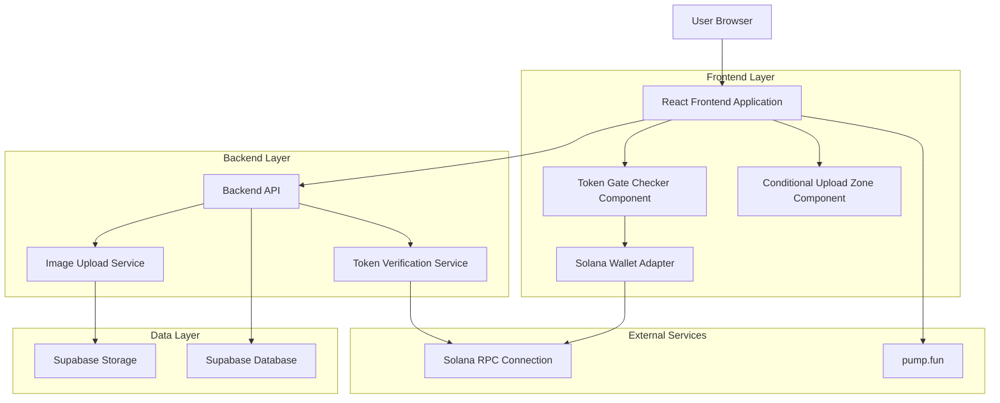
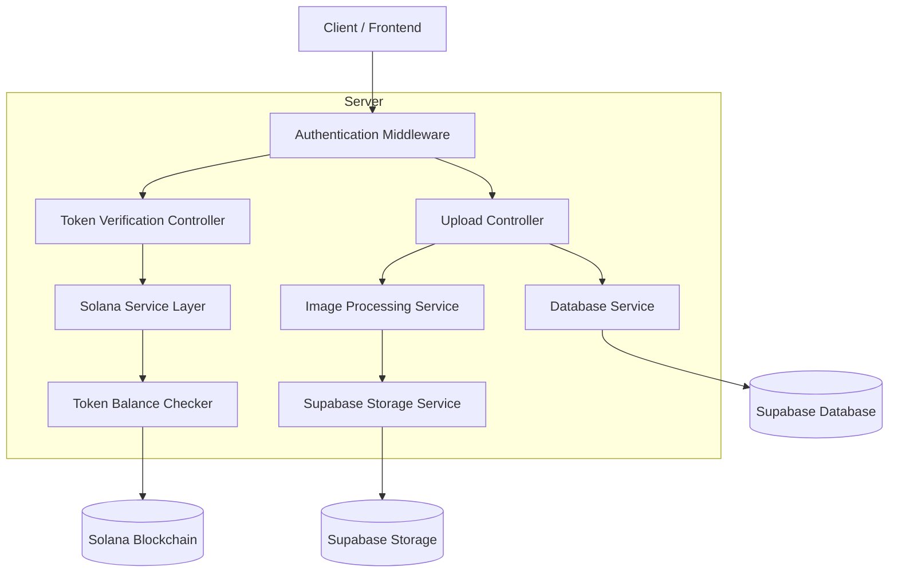
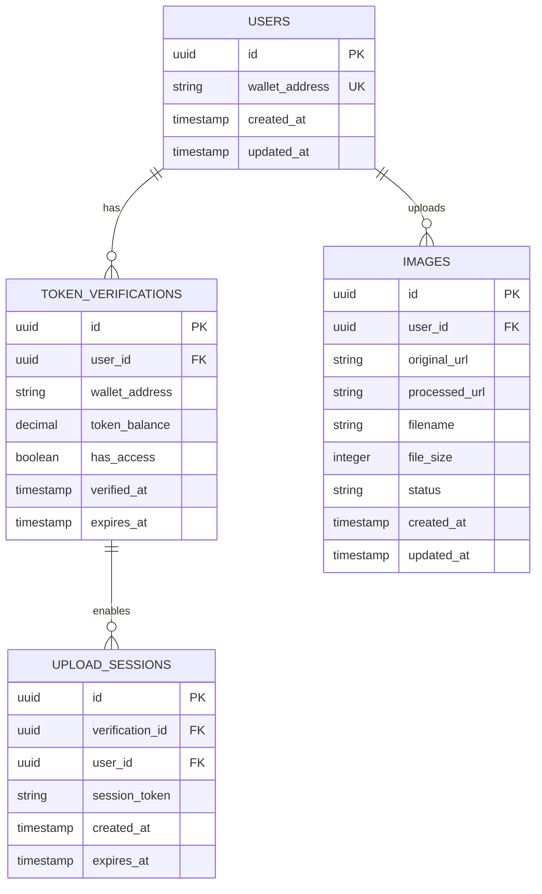

# Token-Gated Image Upload System - Technical Architecture Document

## 1. Architecture Design



## 2. Technology Description

- Frontend: React@18 + TypeScript + tailwindcss@3 + vite
- Backend: Express@4 + TypeScript
- Database: Supabase (PostgreSQL)
- Blockchain: Solana Web3.js + Wallet Adapter
- Storage: Supabase Storage
- Authentication: Solana Wallet-based

## 3. Route Definitions

| Route | Purpose |
|-------|---------|
| /editor | Main editor page with token-gated upload functionality |
| /api/token/verify | Backend endpoint for SOL token balance verification |
| /api/images/upload | Token-gated image upload endpoint |
| /api/images/process | AI enhancement processing endpoint (token-gated) |

## 4. API Definitions

### 4.1 Core API

Token verification endpoint
```
POST /api/token/verify
```

Request:
| Param Name | Param Type | isRequired | Description |
|------------|------------|------------|-------------|
| walletAddress | string | true | User's Solana wallet public key |
| signature | string | true | Signed message for verification |
| message | string | true | Original message that was signed |

Response:
| Param Name | Param Type | Description |
|------------|------------|-------------|
| hasAccess | boolean | Whether user has required token balance |
| tokenBalance | number | Current SOL token balance |
| requiredBalance | number | Minimum required balance (1 SOL) |
| error | string | Error message if verification fails |

Example Request:
```json
{
  "walletAddress": "7xKXtg2CW87d97TXJSDpbD5jBkheTqA83TZRuJosgAsU",
  "signature": "3Bv2UpUi...",
  "message": "Verify token access for V-Sign upload"
}
```

Example Response:
```json
{
  "hasAccess": true,
  "tokenBalance": 2.5,
  "requiredBalance": 1,
  "error": null
}
```

Token-gated image upload endpoint
```
POST /api/images/upload
```

Request:
| Param Name | Param Type | isRequired | Description |
|------------|------------|------------|-------------|
| image | File | true | Image file to upload |
| walletAddress | string | true | User's wallet address for verification |
| signature | string | true | Signed verification message |

Response:
| Param Name | Param Type | Description |
|------------|------------|-------------|
| success | boolean | Upload success status |
| imageId | string | Unique identifier for uploaded image |
| uploadUrl | string | URL of uploaded image |
| error | string | Error message if upload fails |

## 5. Server Architecture Diagram



## 6. Data Model

### 6.1 Data Model Definition



### 6.2 Data Definition Language

Token Verifications Table
```sql
-- Create token_verifications table
CREATE TABLE token_verifications (
    id UUID PRIMARY KEY DEFAULT gen_random_uuid(),
    user_id UUID REFERENCES auth.users(id) ON DELETE CASCADE,
    wallet_address VARCHAR(44) NOT NULL,
    token_balance DECIMAL(18,9) NOT NULL DEFAULT 0,
    has_access BOOLEAN NOT NULL DEFAULT false,
    verified_at TIMESTAMP WITH TIME ZONE DEFAULT NOW(),
    expires_at TIMESTAMP WITH TIME ZONE DEFAULT (NOW() + INTERVAL '1 hour'),
    created_at TIMESTAMP WITH TIME ZONE DEFAULT NOW(),
    updated_at TIMESTAMP WITH TIME ZONE DEFAULT NOW()
);

-- Create indexes
CREATE INDEX idx_token_verifications_wallet ON token_verifications(wallet_address);
CREATE INDEX idx_token_verifications_user_id ON token_verifications(user_id);
CREATE INDEX idx_token_verifications_expires_at ON token_verifications(expires_at);

-- Grant permissions
GRANT SELECT, INSERT, UPDATE ON token_verifications TO anon;
GRANT ALL PRIVILEGES ON token_verifications TO authenticated;
```

Upload Sessions Table
```sql
-- Create upload_sessions table
CREATE TABLE upload_sessions (
    id UUID PRIMARY KEY DEFAULT gen_random_uuid(),
    verification_id UUID REFERENCES token_verifications(id) ON DELETE CASCADE,
    user_id UUID REFERENCES auth.users(id) ON DELETE CASCADE,
    session_token VARCHAR(255) UNIQUE NOT NULL,
    created_at TIMESTAMP WITH TIME ZONE DEFAULT NOW(),
    expires_at TIMESTAMP WITH TIME ZONE DEFAULT (NOW() + INTERVAL '30 minutes')
);

-- Create indexes
CREATE INDEX idx_upload_sessions_token ON upload_sessions(session_token);
CREATE INDEX idx_upload_sessions_user_id ON upload_sessions(user_id);
CREATE INDEX idx_upload_sessions_expires_at ON upload_sessions(expires_at);

-- Grant permissions
GRANT SELECT, INSERT, UPDATE ON upload_sessions TO anon;
GRANT ALL PRIVILEGES ON upload_sessions TO authenticated;
```

Enhanced Images Table
```sql
-- Modify existing images table to include token verification
ALTER TABLE images ADD COLUMN verification_id UUID REFERENCES token_verifications(id);
ALTER TABLE images ADD COLUMN token_gated BOOLEAN DEFAULT false;

-- Create index for token-gated images
CREATE INDEX idx_images_verification_id ON images(verification_id);
CREATE INDEX idx_images_token_gated ON images(token_gated);

-- Update permissions
GRANT SELECT ON images TO anon;
GRANT ALL PRIVILEGES ON images TO authenticated;
```

Row Level Security Policies
```sql
-- Enable RLS on token_verifications
ALTER TABLE token_verifications ENABLE ROW LEVEL SECURITY;

-- Policy for users to see their own verifications
CREATE POLICY "Users can view own token verifications" ON token_verifications
    FOR SELECT USING (auth.uid() = user_id);

-- Policy for users to insert their own verifications
CREATE POLICY "Users can insert own token verifications" ON token_verifications
    FOR INSERT WITH CHECK (auth.uid() = user_id);

-- Enable RLS on upload_sessions
ALTER TABLE upload_sessions ENABLE ROW LEVEL SECURITY;

-- Policy for users to manage their own upload sessions
CREATE POLICY "Users can manage own upload sessions" ON upload_sessions
    FOR ALL USING (auth.uid() = user_id);

-- Update images table RLS for token-gated access
CREATE POLICY "Token-gated images access" ON images
    FOR SELECT USING (
        NOT token_gated OR 
        EXISTS (
            SELECT 1 FROM token_verifications tv 
            WHERE tv.user_id = auth.uid() 
            AND tv.has_access = true 
            AND tv.expires_at > NOW()
        )
    );
```

Initial Configuration Data
```sql
-- Insert system configuration for token requirements
INSERT INTO system_config (key, value, description) VALUES
('sol_token_address', 'So11111111111111111111111111111111111111111', 'SOL token mint address'),
('minimum_token_balance', '1', 'Minimum SOL tokens required for access'),
('verification_expiry_hours', '1', 'Hours before token verification expires'),
('upload_session_expiry_minutes', '30', 'Minutes before upload session expires');
```