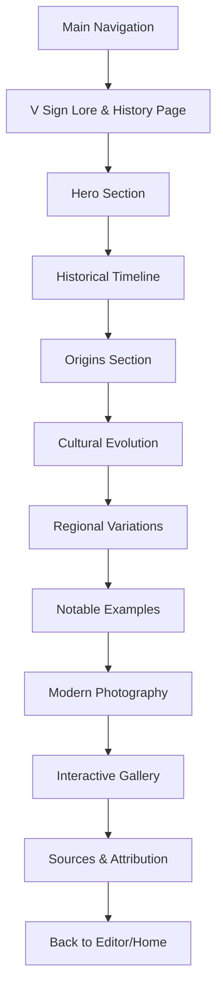

# ✌️-Sign Lore & History Page - Product Requirements Document

## 1. Product Overview

A comprehensive educational page documenting the rich history and cultural evolution of the V Sign gesture, from its origins as a WWII victory symbol to its transformation into the universal peace sign. This page will serve as an informative companion to the ✌️-Sign Photo Editor, providing users with cultural context and historical significance behind the gesture they're editing in their photos.

The page aims to educate users about the fascinating journey of the V Sign through different eras, cultures, and movements, enhancing their appreciation for this iconic gesture while positioning the ✌️-Sign Photo Editor as culturally aware and historically informed.

## 2. Core Features

### 2.1 User Roles
This page will be accessible to all users without role restrictions, serving as educational content for anyone interested in the V Sign's history.

| Role | Access Method | Permissions |
|------|---------------|-------------|
| All Users | Direct navigation from main menu | Full read access to all historical content |
| Guests | Public access without login | Full read access to all historical content |

### 2.2 Feature Module

Our V Sign Lore & History page consists of the following main sections:
1. **Historical Timeline**: Interactive chronological journey from WWII to modern day
2. **Cultural Variations**: Regional differences and meanings across cultures  
3. **Notable Moments**: Famous uses and iconic photographs
4. **Modern Impact**: Evolution into social media and photography culture
5. **Interactive Gallery**: Visual examples and historical photographs

### 2.3 Page Details

| Page Name | Module Name | Feature description |
|-----------|-------------|---------------------|
| V Sign Lore & History | Hero Section | Display iconic V Sign imagery with animated timeline introduction. Include navigation breadcrumbs and page overview |
| V Sign Lore & History | Historical Timeline | Interactive timeline showing key moments: 1941 Victor de Laveleye's BBC broadcast, Churchill's adoption, 1960s peace movement transformation. Include hover effects and detailed descriptions |
| V Sign Lore & History | Origins Section | Detailed account of WWII "V for Victory" campaign, Victor de Laveleye's role, BBC broadcasts, and Churchill's popularization. Include historical context and quotes |
| V Sign Lore & History | Cultural Evolution | Document transformation from victory symbol to peace sign during Vietnam War era. Cover hippie movement adoption and counterculture significance |
| V Sign Lore & History | Regional Variations | Explain different meanings: victory (palm out), offensive gesture (palm in), cultural differences across UK, Australia, US, and other regions |
| V Sign Lore & History | Notable Examples | Showcase famous uses by Churchill, Nixon, celebrities, and cultural movements. Include iconic photographs and their historical context |
| V Sign Lore & History | Modern Photography | Connect historical significance to modern selfie culture and social media usage. Explain why V Sign became ubiquitous in photography |
| V Sign Lore & History | Interactive Gallery | Curated collection of historical photographs, propaganda posters, and cultural artifacts. Include zoom functionality and detailed captions |
| V Sign Lore & History | Sources & Attribution | Comprehensive bibliography and proper attribution to Know Your Meme, Wikipedia, historical archives, and other sources |

## 3. Core Process

**User Navigation Flow:**
Users can access the V Sign Lore & History page from the main navigation menu. The page provides a self-guided educational experience where users can explore different sections at their own pace, with smooth scrolling between sections and optional deep-dive content.

**Content Consumption Flow:**
1. Users land on hero section with overview
2. Progress through interactive timeline
3. Explore detailed historical sections
4. View cultural variations and regional differences
5. Browse notable examples and iconic moments
6. Understand modern photography connection
7. Access sources and additional reading

## 4. User Interface Design

### 4.1 Design Style

- **Primary Colors**: Dark background (#0f172a) consistent with app theme, Solana purple gradient (#9945FF to #14F195) for accents and highlights
- **Typography**: Clean, readable fonts with larger text for historical quotes and key information. Serif fonts for historical content to convey gravitas
- **Layout Style**: Vertical scrolling timeline design with card-based content sections. Sticky navigation for easy section jumping
- **Visual Elements**: Historical photographs, propaganda posters, and cultural artifacts integrated seamlessly. Subtle animations for timeline progression
- **Interactive Elements**: Hover effects on timeline items, expandable content sections, image zoom functionality for gallery items

### 4.2 Page Design Overview

| Page Name | Module Name | UI Elements |
|-----------|-------------|-------------|
| V Sign Lore & History | Hero Section | Large ✌️ symbol with animated background, gradient overlay, breadcrumb navigation, scroll indicator |
| V Sign Lore & History | Historical Timeline | Vertical timeline with interactive nodes, date markers, expandable content cards, smooth scroll animations |
| V Sign Lore & History | Origins Section | Historical photographs of Churchill and de Laveleye, quote blocks with distinctive styling, BBC radio imagery |
| V Sign Lore & History | Cultural Evolution | Split-screen design showing WWII vs 1960s imagery, transition animations, hippie movement visuals |
| V Sign Lore & History | Regional Variations | Interactive world map or flag icons, comparison cards showing palm orientations, cultural context boxes |
| V Sign Lore & History | Notable Examples | Photo gallery grid with hover effects, caption overlays, historical context popups |
| V Sign Lore & History | Modern Photography | Social media mockups, before/after comparisons, statistics visualization |
| V Sign Lore & History | Interactive Gallery | Masonry layout for historical images, lightbox functionality, detailed metadata display |
| V Sign Lore & History | Sources & Attribution | Clean bibliography format, external link styling, academic citation format |

### 4.3 Responsiveness

The page will be mobile-first responsive design, optimizing the timeline and gallery for touch interactions on mobile devices. Desktop users will benefit from larger imagery and more detailed hover states, while mobile users get streamlined, touch-friendly navigation and optimized image loading.

## 5. Content Strategy

### 5.1 Historical Accuracy
All content will be thoroughly researched and fact-checked, with proper attribution to sources including Know Your Meme, Wikipedia, historical archives, and academic sources. <mcreference link="https://knowyourmeme.com/memes/v-sign" index="1">1</mcreference> <mcreference link="https://en.wikipedia.org/wiki/V_sign" index="2">2</mcreference>

### 5.2 Educational Value
The page will serve as both entertainment and education, providing users with genuine historical insights while maintaining engagement through interactive elements and visual storytelling.

### 5.3 Cultural Sensitivity
Content will acknowledge the different cultural meanings and potential offensive interpretations of the V Sign gesture, providing appropriate context and cultural awareness. <mcreference link="https://en.wikipedia.org/wiki/V_sign" index="2">2</mcreference>

## 6. Technical Integration

### 6.1 Navigation Integration
The V Sign Lore & History page will be added to the main navigation menu alongside existing pages (Home, Editor, Gallery), maintaining consistent branding and user experience.

### 6.2 Performance Considerations
Historical images and interactive elements will be optimized for fast loading, with lazy loading for gallery images and progressive enhancement for animations.

### 6.3 SEO and Accessibility
The page will include proper semantic HTML, alt text for all historical images, and meta descriptions to improve discoverability while maintaining accessibility standards for all users.