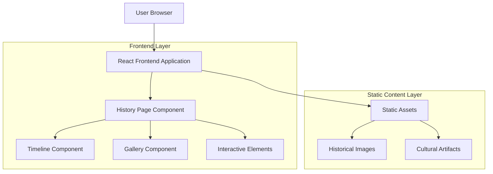

# ✌️-Sign Lore & History Page - Technical Architecture Document

## 1. Architecture Design



## 2. Technology Description

- **Frontend**: React@18 + TypeScript + Tailwind CSS@3 + Vite
- **Animation Library**: Framer Motion for timeline animations and transitions
- **Image Optimization**: React Image Gallery for interactive photo viewing
- **Responsive Design**: Tailwind CSS responsive utilities
- **Icons**: Lucide React for consistent iconography
- **Backend**: None (static content page)

## 3. Route Definitions

| Route | Purpose |
|-------|---------|
| /history | V Sign Lore & History main page with full timeline and content |
| /history#timeline | Direct link to historical timeline section |
| /history#origins | Direct link to WWII origins section |
| /history#evolution | Direct link to cultural evolution section |
| /history#variations | Direct link to regional variations section |
| /history#gallery | Direct link to interactive photo gallery |

## 4. Component Architecture

### 4.1 Main Components

```typescript
// History Page Structure
interface HistoryPageProps {
  sections: HistorySection[];
  timeline: TimelineEvent[];
  gallery: HistoricalImage[];
}

interface TimelineEvent {
  id: string;
  date: string;
  title: string;
  description: string;
  image?: string;
  significance: string;
  sources: string[];
}

interface HistoricalImage {
  id: string;
  url: string;
  title: string;
  description: string;
  date: string;
  source: string;
  category: 'wwii' | 'peace-movement' | 'modern' | 'cultural';
}

interface HistorySection {
  id: string;
  title: string;
  content: string;
  images: HistoricalImage[];
  timeline?: TimelineEvent[];
}
```

### 4.2 Component Hierarchy

```
HistoryPage
├── HistoryHero
├── HistoryNavigation
├── TimelineSection
│   ├── TimelineItem[]
│   └── TimelineNavigation
├── OriginsSection
│   ├── ChurchillProfile
│   ├── BBCCampaign
│   └── WarContext
├── EvolutionSection
│   ├── PeaceMovement
│   ├── HippieInfluence
│   └── VietnamContext
├── VariationsSection
│   ├── RegionalMap
│   ├── CulturalMeanings
│   └── OffensiveGesture
├── NotableExamples
│   ├── PoliticalFigures
│   ├── CelebrityUses
│   └── IconicMoments
├── ModernImpact
│   ├── SocialMedia
│   ├── Photography
│   └── GlobalAdoption
├── InteractiveGallery
│   ├── ImageGrid
│   ├── Lightbox
│   └── FilterControls
└── SourcesAttribution
    ├── Bibliography
    ├── ImageCredits
    └── ExternalLinks
```

## 5. Data Structure

### 5.1 Historical Timeline Data

```typescript
const timelineEvents: TimelineEvent[] = [
  {
    id: 'laveleye-broadcast',
    date: '1941-01-14',
    title: 'Victor de Laveleye\'s BBC Broadcast',
    description: 'Belgian politician suggests V sign as symbol of unity',
    significance: 'Origin of V for Victory campaign',
    sources: ['BBC Archives', 'Know Your Meme']
  },
  {
    id: 'churchill-adoption',
    date: '1941-07-19',
    title: 'Churchill Endorses V for Victory',
    description: 'Prime Minister begins using V sign in public appearances',
    significance: 'Popularization of gesture among Allied forces',
    sources: ['TIME Magazine', 'Imperial War Museums']
  },
  {
    id: 'peace-transformation',
    date: '1960s',
    title: 'Peace Movement Adoption',
    description: 'Vietnam War protesters adopt V sign as peace symbol',
    significance: 'Transformation from victory to peace meaning',
    sources: ['History.com', 'Counterculture Archives']
  }
];
```

### 5.2 Cultural Variations Data

```typescript
const culturalVariations = {
  victory: {
    orientation: 'palm-outward',
    regions: ['United States', 'Most of Europe', 'Global'],
    meaning: 'Victory, Peace, Positive gesture',
    historical_context: 'WWII Allied victory symbol'
  },
  offensive: {
    orientation: 'palm-inward',
    regions: ['United Kingdom', 'Ireland', 'Australia', 'New Zealand'],
    meaning: 'Offensive gesture equivalent to middle finger',
    historical_context: 'Dates back to at least 1900'
  }
};
```

## 6. Static Asset Management

### 6.1 Image Categories

```
public/history/
├── wwii/
│   ├── churchill-v-sign.jpg
│   ├── bbc-campaign-poster.jpg
│   ├── allied-soldiers.jpg
│   └── victory-propaganda.jpg
├── peace-movement/
│   ├── hippie-protesters.jpg
│   ├── vietnam-demonstrations.jpg
│   ├── woodstock-peace.jpg
│   └── counterculture-icons.jpg
├── modern/
│   ├── social-media-examples.jpg
│   ├── celebrity-v-signs.jpg
│   ├── global-adoption.jpg
│   └── photography-culture.jpg
└── cultural/
    ├── regional-variations.jpg
    ├── offensive-gesture.jpg
    ├── cultural-contexts.jpg
    └── international-meanings.jpg
```

### 6.2 Performance Optimization

```typescript
// Lazy loading implementation
const LazyImage = ({ src, alt, className }: ImageProps) => {
  const [isLoaded, setIsLoaded] = useState(false);
  const [isInView, setIsInView] = useState(false);
  
  return (
    <div className={`transition-opacity ${isLoaded ? 'opacity-100' : 'opacity-0'}`}>
      {isInView && (
         setIsLoaded(true)}
          loading="lazy"
        />
      )}
    </div>
  );
};
```

## 7. Animation and Interaction Design

### 7.1 Timeline Animations

```typescript
// Framer Motion timeline scroll animations
const timelineVariants = {
  hidden: { opacity: 0, x: -50 },
  visible: { 
    opacity: 1, 
    x: 0,
    transition: { duration: 0.6, ease: "easeOut" }
  }
};

const TimelineItem = ({ event, index }: TimelineItemProps) => {
  return (
    <motion.div
      variants={timelineVariants}
      initial="hidden"
      whileInView="visible"
      viewport={{ once: true, margin: "-100px" }}
      className="timeline-item"
    >
      {/* Timeline content */}
    </motion.div>
  );
};
```

### 7.2 Gallery Interactions

```typescript
// Interactive gallery with lightbox
const GalleryImage = ({ image }: GalleryImageProps) => {
  const [isOpen, setIsOpen] = useState(false);
  
  return (
    <>
      <motion.div
        whileHover={{ scale: 1.05 }}
        whileTap={{ scale: 0.95 }}
        onClick={() => setIsOpen(true)}
        className="cursor-pointer"
      >
        
      </motion.div>
      
      <AnimatePresence>
        {isOpen && (
          <Lightbox
            image={image}
            onClose={() => setIsOpen(false)}
          />
        )}
      </AnimatePresence>
    </>
  );
};
```

## 8. Responsive Design Implementation

### 8.1 Breakpoint Strategy

```css
/* Tailwind CSS responsive classes */
.timeline-container {
  @apply flex flex-col lg:flex-row;
}

.timeline-item {
  @apply w-full lg:w-1/2 p-4 lg:p-8;
}

.gallery-grid {
  @apply grid grid-cols-1 sm:grid-cols-2 lg:grid-cols-3 xl:grid-cols-4 gap-4;
}

.hero-section {
  @apply h-screen lg:h-96 flex items-center justify-center;
}
```

### 8.2 Mobile Optimizations

```typescript
// Touch-friendly navigation for mobile
const MobileNavigation = () => {
  return (
    <div className="lg:hidden fixed bottom-4 left-4 right-4 z-50">
      <div className="bg-slate-800 rounded-full p-2 flex justify-around">
        {sections.map(section => (
          <button
            key={section.id}
            onClick={() => scrollToSection(section.id)}
            className="p-3 rounded-full hover:bg-slate-700"
          >
            <section.icon className="w-5 h-5" />
          </button>
        ))}
      </div>
    </div>
  );
};
```

## 9. SEO and Accessibility

### 9.1 Meta Tags and Structure

```typescript
// SEO optimization
const HistoryPageHead = () => {
  return (
    <Helmet>
      <title>✌️-Sign History & Cultural Lore | Peace Symbol Origins</title>
      <meta name="description" content="Discover the fascinating history of the V Sign gesture, from WWII victory symbol to universal peace sign. Learn about Churchill, the hippie movement, and cultural significance." />
      <meta name="keywords" content="V sign history, peace symbol, Churchill victory, hippie movement, cultural gesture" />
      <meta property="og:title" content="The Complete History of the ✌️ V Sign Gesture" />
      <meta property="og:description" content="From Winston Churchill's wartime victory symbol to the universal peace sign of the counterculture movement." />
    </Helmet>
  );
};
```

### 9.2 Accessibility Features

```typescript
// Screen reader and keyboard navigation support
const AccessibleTimeline = () => {
  return (
    <section 
      role="main" 
      aria-label="Historical timeline of V Sign gesture"
    >
      <h2 id="timeline-heading">Historical Timeline</h2>
      <ol aria-labelledby="timeline-heading">
        {timelineEvents.map((event, index) => (
          <li 
            key={event.id}
            tabIndex={0}
            aria-describedby={`event-${event.id}`}
            onKeyDown={(e) => handleKeyNavigation(e, index)}
          >
            <h3>{event.title}</h3>
            <p id={`event-${event.id}`}>{event.description}</p>
          </li>
        ))}
      </ol>
    </section>
  );
};
```

## 10. Integration with Existing Application

### 10.1 Navigation Updates

```typescript
// Update main navigation to include History page
const navigationItems = [
  { path: '/', label: 'Home', icon: Home },
  { path: '/editor', label: 'Editor', icon: Edit },
  { path: '/gallery', label: 'Gallery', icon: Image },
  { path: '/history', label: 'History', icon: BookOpen }, // New addition
  { path: '/login', label: 'Login', icon: LogIn }
];
```

### 10.2 Routing Configuration

```typescript
// React Router setup
const AppRoutes = () => {
  return (
    <Routes>
      <Route path="/" element={<Home />} />
      <Route path="/editor" element={<Editor />} />
      <Route path="/gallery" element={<Gallery />} />
      <Route path="/history" element={<HistoryPage />} /> {/* New route */}
      <Route path="/login" element={<Login />} />
      <Route path="/register" element={<Register />} />
    </Routes>
  );
};
```

This technical architecture provides a comprehensive foundation for implementing the V Sign Lore & History page while maintaining consistency with the existing ✌️-Sign Photo Editor application architecture and design principles.