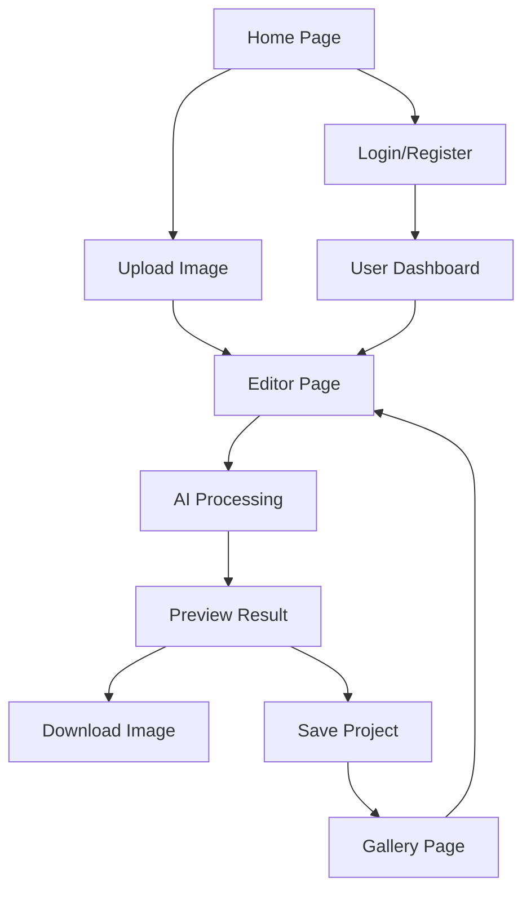

# V-Sign Photo Editor - Product Requirements Document

## 1. Product Overview

V-Sign Photo Editor is an AI-powered web application that allows users to upload their photos and automatically add realistic V sign hand gestures using Google Gemini 2.5 Flash Image API. The platform provides an intuitive interface for photo enhancement with cutting-edge AI technology.

The product solves the problem of manually editing photos to add hand gestures, targeting social media users, content creators, and photography enthusiasts who want to enhance their images with trendy V sign poses. The application leverages Google's advanced AI image generation capabilities to create natural-looking hand gesture additions.

This product aims to capture the growing market of AI-powered photo editing tools, estimated to reach $1.2 billion by 2025, by offering specialized V sign gesture enhancement functionality.

## 2. Core Features

### 2.1 User Roles

| Role | Registration Method | Core Permissions |
|------|---------------------|------------------|
| Guest User | No registration required | Can upload and edit up to 3 images per session |
| Registered User | Email registration | Unlimited image uploads, save editing history, download high-resolution images |

### 2.2 Feature Module

Our V-Sign Photo Editor consists of the following main pages:
1. **Home Page**: Hero section with product showcase, feature highlights, upload interface, and navigation menu.
2. **Editor Page**: Image upload area, AI processing workspace, preview panel, and download options.
3. **Gallery Page**: User's edited image history, saved projects, and sharing options.
4. **Authentication Pages**: Login and registration forms for user account management.

### 2.3 Page Details

| Page Name | Module Name | Feature description |
|-----------|-------------|---------------------|
| Home Page | Hero Section | Display product introduction with sample before/after images, call-to-action buttons |
| Home Page | Feature Highlights | Showcase AI capabilities, processing speed, and image quality examples |
| Home Page | Quick Upload | Drag-and-drop interface for immediate image upload and processing |
| Editor Page | Image Upload | Support drag-and-drop, file picker, and paste from clipboard for image input |
| Editor Page | AI Processing | Integrate Gemini 2.5 Flash Image API to add V sign hand gestures with customizable positioning |
| Editor Page | Preview Panel | Real-time preview of original and processed images with zoom and comparison tools |
| Editor Page | Download Manager | Export processed images in multiple formats (PNG, JPG) and resolutions |
| Gallery Page | Image History | Display user's previously edited images with thumbnails and metadata |
| Gallery Page | Project Management | Save, organize, and re-edit previous projects with version control |
| Authentication Pages | Login Form | Email/password authentication with social login options |
| Authentication Pages | Registration Form | User account creation with email verification and profile setup |

## 3. Core Process

**Guest User Flow:**
Users can immediately start using the application by uploading an image on the home page. The system processes the image using Gemini AI to add V sign hand gestures, displays the result in the preview panel, and allows download of the processed image. Guest users are limited to 3 images per session.

**Registered User Flow:**
Registered users access additional features including unlimited uploads, image history, and project saving. They can log in, upload multiple images, customize V sign positioning, save projects for later editing, and access their complete editing history through the gallery page.

## 4. User Interface Design

### 4.1 Design Style

- **Primary Colors**: Deep blue (#1E40AF) and vibrant green (#10B981) for modern, tech-forward appearance
- **Secondary Colors**: Light gray (#F3F4F6) backgrounds with white (#FFFFFF) content areas
- **Button Style**: Rounded corners (8px radius) with subtle shadows and hover animations
- **Typography**: Inter font family with 16px base size, bold headings at 24px and 32px
- **Layout Style**: Card-based design with clean spacing, top navigation bar, and centered content areas
- **Icons**: Outline-style icons with 2px stroke width, complemented by hand gesture emojis (✌️, 📸)

### 4.2 Page Design Overview

| Page Name | Module Name | UI Elements |
|-----------|-------------|-------------|
| Home Page | Hero Section | Large background image with overlay text, gradient buttons, animated V sign demonstrations |
| Home Page | Feature Highlights | Three-column grid layout with icons, feature cards with hover effects, testimonial carousel |
| Editor Page | Upload Area | Dashed border drop zone, file picker button, progress indicators, supported format badges |
| Editor Page | Processing Panel | Split-screen layout, loading animations, AI processing status, before/after slider comparison |
| Gallery Page | Image Grid | Masonry layout with hover overlays, filter options, search functionality, pagination controls |
| Authentication | Forms | Centered modal design, input field animations, social login buttons, validation messages |

### 4.3 Responsiveness

The application follows a mobile-first approach with responsive breakpoints at 768px (tablet) and 1024px (desktop). Touch interactions are optimized for mobile devices with larger tap targets and swipe gestures for image comparison. The upload interface adapts to smaller screens with simplified drag-and-drop areas and accessible file picker alternatives.