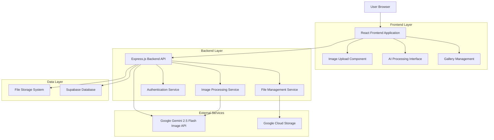
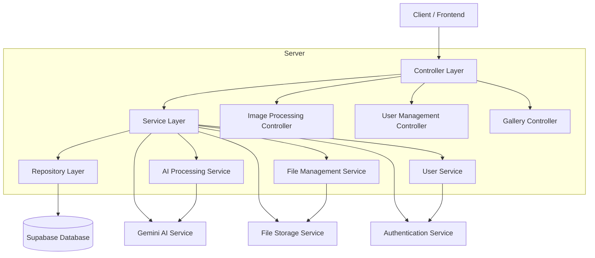
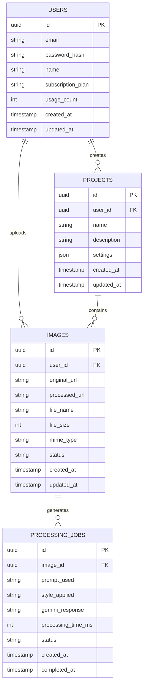

# V-Sign Photo Editor - Technical Architecture Document

## 1. Architecture Design



## 2. Technology Description

- **Frontend**: React@18 + TypeScript + Tailwind CSS@3 + Vite
- **Backend**: Express.js@4 + Node.js@18 + TypeScript
- **Database**: Supabase (PostgreSQL)
- **File Storage**: Google Cloud Storage
- **AI Service**: Google Gemini 2.5 Flash Image API
- **Authentication**: Supabase Auth

## 3. Route Definitions

| Route | Purpose |
|-------|---------|
| / | Home page with hero section and quick upload interface |
| /editor | Main editing workspace with AI processing capabilities |
| /gallery | User's image history and project management |
| /login | User authentication and login |
| /register | User registration and account creation |
| /profile | User profile settings and subscription management |

## 4. API Definitions

### 4.1 Core API

**Image Upload and Processing**
```
POST /api/images/upload
```

Request:
| Param Name | Param Type | isRequired | Description |
|------------|------------|------------|-------------|
| image | File | true | Image file (PNG, JPG, JPEG) up to 10MB |
| userId | string | false | User ID for registered users |

Response:
| Param Name | Param Type | Description |
|------------|------------|-------------|
| success | boolean | Upload status |
| imageId | string | Unique identifier for uploaded image |
| originalUrl | string | URL of original uploaded image |

**AI V-Sign Processing**
```
POST /api/images/process-vsign
```

Request:
| Param Name | Param Type | isRequired | Description |
|------------|------------|------------|-------------|
| imageId | string | true | ID of uploaded image |
| prompt | string | false | Custom prompt for V-sign positioning |
| style | string | false | Style preference (natural, artistic, cartoon) |

Response:
| Param Name | Param Type | Description |
|------------|------------|-------------|
| success | boolean | Processing status |
| processedUrl | string | URL of processed image with V-sign |
| processingTime | number | Time taken for AI processing in seconds |

**User Authentication**
```
POST /api/auth/login
```

Request:
| Param Name | Param Type | isRequired | Description |
|------------|------------|------------|-------------|
| email | string | true | User email address |
| password | string | true | User password |

Response:
| Param Name | Param Type | Description |
|------------|------------|-------------|
| success | boolean | Authentication status |
| token | string | JWT authentication token |
| user | object | User profile information |

Example Request:
```json
{
  "email": "user@example.com",
  "password": "securepassword123"
}
```

## 5. Server Architecture Diagram



## 6. Data Model

### 6.1 Data Model Definition



### 6.2 Data Definition Language

**Users Table**
```sql
-- Create users table
CREATE TABLE users (
    id UUID PRIMARY KEY DEFAULT gen_random_uuid(),
    email VARCHAR(255) UNIQUE NOT NULL,
    password_hash VARCHAR(255) NOT NULL,
    name VARCHAR(100) NOT NULL,
    subscription_plan VARCHAR(20) DEFAULT 'free' CHECK (subscription_plan IN ('free', 'premium')),
    usage_count INTEGER DEFAULT 0,
    created_at TIMESTAMP WITH TIME ZONE DEFAULT NOW(),
    updated_at TIMESTAMP WITH TIME ZONE DEFAULT NOW()
);

-- Create index for email lookups
CREATE INDEX idx_users_email ON users(email);
```

**Images Table**
```sql
-- Create images table
CREATE TABLE images (
    id UUID PRIMARY KEY DEFAULT gen_random_uuid(),
    user_id UUID REFERENCES users(id) ON DELETE CASCADE,
    original_url TEXT NOT NULL,
    processed_url TEXT,
    file_name VARCHAR(255) NOT NULL,
    file_size INTEGER NOT NULL,
    mime_type VARCHAR(50) NOT NULL,
    status VARCHAR(20) DEFAULT 'uploaded' CHECK (status IN ('uploaded', 'processing', 'completed', 'failed')),
    created_at TIMESTAMP WITH TIME ZONE DEFAULT NOW(),
    updated_at TIMESTAMP WITH TIME ZONE DEFAULT NOW()
);

-- Create indexes
CREATE INDEX idx_images_user_id ON images(user_id);
CREATE INDEX idx_images_status ON images(status);
CREATE INDEX idx_images_created_at ON images(created_at DESC);
```

**Processing Jobs Table**
```sql
-- Create processing_jobs table
CREATE TABLE processing_jobs (
    id UUID PRIMARY KEY DEFAULT gen_random_uuid(),
    image_id UUID REFERENCES images(id) ON DELETE CASCADE,
    prompt_used TEXT NOT NULL,
    style_applied VARCHAR(50) DEFAULT 'natural',
    gemini_response JSONB,
    processing_time_ms INTEGER,
    status VARCHAR(20) DEFAULT 'pending' CHECK (status IN ('pending', 'processing', 'completed', 'failed')),
    created_at TIMESTAMP WITH TIME ZONE DEFAULT NOW(),
    completed_at TIMESTAMP WITH TIME ZONE
);

-- Create indexes
CREATE INDEX idx_processing_jobs_image_id ON processing_jobs(image_id);
CREATE INDEX idx_processing_jobs_status ON processing_jobs(status);
```

**Projects Table**
```sql
-- Create projects table
CREATE TABLE projects (
    id UUID PRIMARY KEY DEFAULT gen_random_uuid(),
    user_id UUID REFERENCES users(id) ON DELETE CASCADE,
    name VARCHAR(255) NOT NULL,
    description TEXT,
    settings JSONB DEFAULT '{}',
    created_at TIMESTAMP WITH TIME ZONE DEFAULT NOW(),
    updated_at TIMESTAMP WITH TIME ZONE DEFAULT NOW()
);

-- Create indexes
CREATE INDEX idx_projects_user_id ON projects(user_id);
CREATE INDEX idx_projects_created_at ON projects(created_at DESC);
```

**Row Level Security (RLS) Policies**
```sql
-- Enable RLS on all tables
ALTER TABLE users ENABLE ROW LEVEL SECURITY;
ALTER TABLE images ENABLE ROW LEVEL SECURITY;
ALTER TABLE processing_jobs ENABLE ROW LEVEL SECURITY;
ALTER TABLE projects ENABLE ROW LEVEL SECURITY;

-- Grant basic access to anon role
GRANT SELECT ON images TO anon;
GRANT INSERT ON images TO anon;

-- Grant full access to authenticated users
GRANT ALL PRIVILEGES ON users TO authenticated;
GRANT ALL PRIVILEGES ON images TO authenticated;
GRANT ALL PRIVILEGES ON processing_jobs TO authenticated;
GRANT ALL PRIVILEGES ON projects TO authenticated;

-- Create RLS policies
CREATE POLICY "Users can view own data" ON users FOR ALL USING (auth.uid() = id);
CREATE POLICY "Users can manage own images" ON images FOR ALL USING (auth.uid() = user_id);
CREATE POLICY "Users can view own processing jobs" ON processing_jobs FOR ALL USING (
    auth.uid() = (SELECT user_id FROM images WHERE images.id = processing_jobs.image_id)
);
CREATE POLICY "Users can manage own projects" ON projects FOR ALL USING (auth.uid() = user_id);
```

**Initial Data**
```sql
-- Insert sample data for testing
INSERT INTO users (email, password_hash, name, subscription_plan) VALUES
('demo@vsigneditor.com', '$2b$10$example_hash', 'Demo User', 'premium'),
('test@example.com', '$2b$10$example_hash', 'Test User', 'free');
```