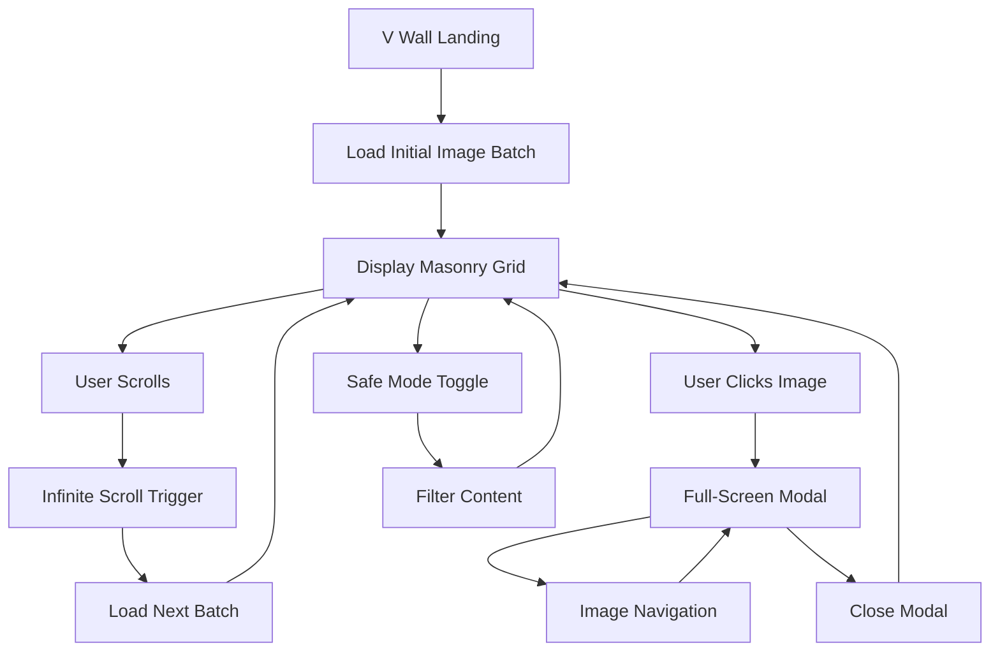

# V Wall Gallery - Product Requirements Document

## 1. Product Overview

V Wall is a borderless, full-screen public gallery that seamlessly displays all generated V-sign images in an optimized viewing experience. The page serves as a community showcase where users can explore the creative output of the ✌️-Sign PFP-Gen platform in a visually stunning, Pinterest-style layout.

The V Wall transforms the traditional gallery concept into an immersive, infinite browsing experience that celebrates the community's creativity while maintaining optimal performance across all devices and network conditions.

## 2. Core Features

### 2.1 User Roles

| Role | Registration Method | Core Permissions |
|------|---------------------|------------------|
| Public Viewer | No registration required | Can browse all public images, use moderation toggles |
| Registered User | Email registration | Can browse images, report content, access full-resolution downloads |
| Moderator | Admin invitation | Can moderate content, manage safe-mode settings, remove inappropriate content |

### 2.2 Feature Module

Our V Wall requirements consist of the following main components:

1. **V Wall Gallery Page**: Masonry grid layout, infinite scroll, image optimization, moderation controls
2. **Image Detail Modal**: Full-screen image view, metadata display, sharing options, download functionality
3. **Moderation Panel**: Safe-mode toggles, content filtering, reporting system

### 2.3 Page Details

| Page Name | Module Name | Feature description |
|-----------|-------------|---------------------|
| V Wall Gallery | Masonry Grid System | Display images in responsive Pinterest-style layout with zero gaps. Implement intelligent column distribution based on screen size and image aspect ratios |
| V Wall Gallery | Infinite Scroll Engine | Load images in batches of 20-50 items with smooth scrolling. Implement virtual scrolling for memory optimization and progressive loading indicators |
| V Wall Gallery | Lazy Loading System | Load images progressively with blur-to-sharp transitions. Include skeleton placeholders and intelligent preloading based on scroll velocity |
| V Wall Gallery | Interactive Controls | Hover effects with subtle scaling and overlay information. Touch-optimized gestures for mobile including pinch-to-zoom preview |
| V Wall Gallery | Safe Mode Toggle | Per-image moderation controls with instant filtering. Community-driven content flagging system with real-time updates |
| Image Detail Modal | Full-Screen Viewer | Modal overlay with high-resolution image display. Include zoom functionality, metadata panel, and sharing options |
| Image Detail Modal | Navigation Controls | Previous/next image navigation with keyboard shortcuts. Smooth transitions between images with preloading |
| Moderation Panel | Content Management | Admin interface for bulk moderation actions. Analytics dashboard showing engagement metrics and content statistics |

## 3. Core Process

**Public User Flow:**
Users access the V Wall directly from the main navigation. The page loads with an initial batch of images in a seamless masonry layout. As users scroll, new images load automatically with smooth animations. Users can hover over images to see basic information and click to view full-screen details. Safe-mode toggle allows filtering of potentially sensitive content.

**Registered User Flow:**
Registered users follow the same browsing experience but gain additional capabilities including high-resolution downloads, content reporting, and personalized viewing preferences. They can save favorite images and access viewing history.

**Moderator Flow:**
Moderators access additional controls for content management, including bulk moderation actions, analytics dashboard, and community reporting review system.

## 4. User Interface Design

### 4.1 Design Style

- **Primary Colors**: Solana gradient (#9945FF to #19FB9B), Dark theme (#1a1a1a, #2d2d2d)
- **Secondary Colors**: Neutral grays (#6b7280, #9ca3af) for text and subtle UI elements
- **Button Style**: Minimal floating action buttons with subtle shadows and hover states
- **Font**: Inter or system fonts, 14px base size for UI elements, responsive scaling
- **Layout Style**: Borderless masonry grid with intelligent spacing, full-screen immersive experience
- **Animation Style**: Smooth 300ms transitions, subtle scale effects on hover, progressive loading animations

### 4.2 Page Design Overview

| Page Name | Module Name | UI Elements |
|-----------|-------------|-------------|
| V Wall Gallery | Masonry Grid | Borderless image tiles with 2-6 columns based on screen size. Hover overlay with subtle dark gradient and action icons. Progressive blur-to-sharp loading animation |
| V Wall Gallery | Navigation Header | Minimal transparent header with V Wall title and safe-mode toggle. Floating design that appears/disappears on scroll |
| V Wall Gallery | Loading States | Skeleton placeholders matching masonry layout. Shimmer animation effect during loading. Smooth fade-in transitions for new content |
| Image Detail Modal | Full-Screen Overlay | Dark backdrop with centered image. Minimal UI controls with auto-hide functionality. Smooth zoom and pan interactions |
| Image Detail Modal | Metadata Panel | Sliding panel with image details, creation date, and sharing options. Glassmorphism design with backdrop blur |

### 4.3 Responsiveness

The V Wall is designed mobile-first with adaptive column layouts: 2 columns on mobile (320px+), 3 columns on tablet (768px+), 4-6 columns on desktop (1024px+). Touch interactions are optimized for mobile with gesture support for navigation and zooming. The interface adapts seamlessly to both portrait and landscape orientations with intelligent column redistribution.