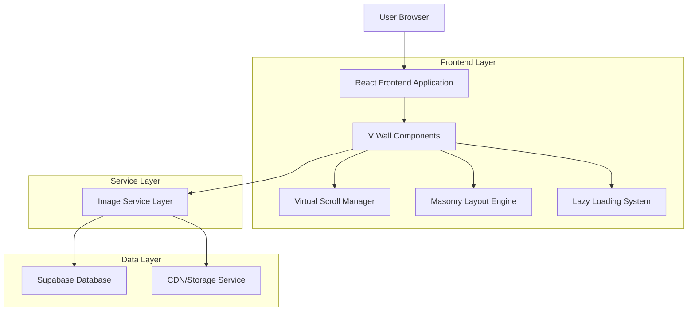
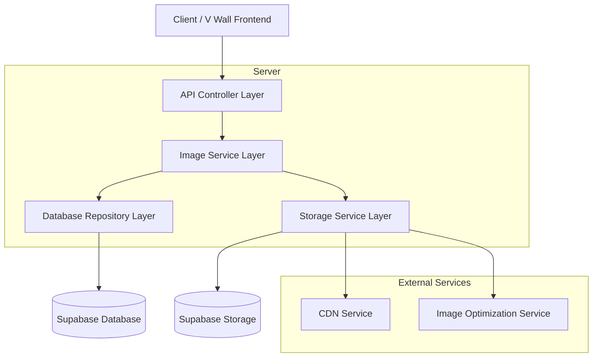
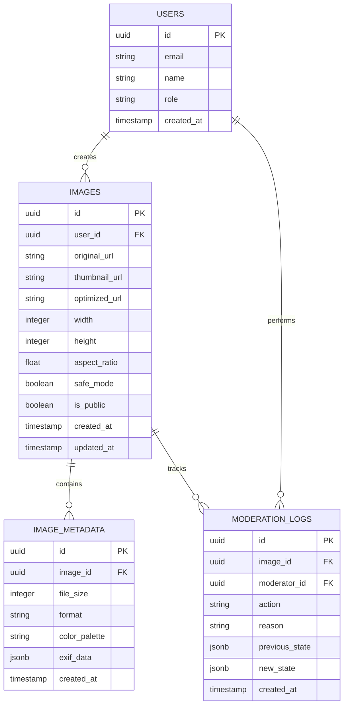

# V Wall Gallery - Technical Architecture Document

## 1. Architecture Design



## 2. Technology Description

- Frontend: React@18 + TypeScript + Tailwind CSS + Framer Motion
- State Management: Zustand for image gallery state
- Virtual Scrolling: React-window or custom implementation
- Image Optimization: Next.js Image component patterns adapted for Vite
- Database: Supabase (PostgreSQL) with real-time subscriptions
- Storage: Supabase Storage with CDN optimization

## 3. Route Definitions

| Route | Purpose |
|-------|---------|
| /v-wall | Main V Wall gallery page with masonry grid layout |
| /v-wall/:imageId | Direct link to specific image in modal view |
| /v-wall/moderation | Admin moderation panel for content management |

## 4. API Definitions

### 4.1 Core API

**Image Gallery Endpoints**

```
GET /api/images/gallery
```

Request:
| Param Name | Param Type | isRequired | Description |
|------------|------------|------------|-------------|
| page | number | false | Page number for pagination (default: 1) |
| limit | number | false | Number of images per page (default: 50) |
| safe_mode | boolean | false | Filter content based on safe mode setting |
| cursor | string | false | Cursor for infinite scroll pagination |

Response:
| Param Name | Param Type | Description |
|------------|------------|-------------|
| images | ImageItem[] | Array of image objects with metadata |
| nextCursor | string | Cursor for next page of results |
| hasMore | boolean | Whether more images are available |

Example Response:
```json
{
  "images": [
    {
      "id": "uuid",
      "originalUrl": "https://storage.url/original.jpg",
      "thumbnailUrl": "https://storage.url/thumb.jpg",
      "width": 1024,
      "height": 768,
      "aspectRatio": 1.33,
      "createdAt": "2024-01-01T00:00:00Z",
      "safeMode": true,
      "metadata": {
        "fileSize": 245760,
        "format": "jpeg"
      }
    }
  ],
  "nextCursor": "eyJpZCI6InV1aWQiLCJjcmVhdGVkQXQiOiIyMDI0LTAxLTAxVDAwOjAwOjAwWiJ9",
  "hasMore": true
}
```

**Image Moderation Endpoints**

```
PATCH /api/images/:id/moderation
```

Request:
| Param Name | Param Type | isRequired | Description |
|------------|------------|------------|-------------|
| safeMode | boolean | true | Set safe mode status for image |
| reason | string | false | Reason for moderation action |

Response:
| Param Name | Param Type | Description |
|------------|------------|-------------|
| success | boolean | Operation success status |
| image | ImageItem | Updated image object |

## 5. Server Architecture Diagram



## 6. Data Model

### 6.1 Data Model Definition



### 6.2 Data Definition Language

**Images Table (Enhanced for V Wall)**
```sql
-- Enhanced images table for V Wall functionality
CREATE TABLE images (
    id UUID PRIMARY KEY DEFAULT gen_random_uuid(),
    user_id UUID REFERENCES auth.users(id) ON DELETE CASCADE,
    original_url TEXT NOT NULL,
    thumbnail_url TEXT,
    optimized_url TEXT,
    width INTEGER NOT NULL,
    height INTEGER NOT NULL,
    aspect_ratio DECIMAL(10,8) GENERATED ALWAYS AS (CAST(width AS DECIMAL) / CAST(height AS DECIMAL)) STORED,
    safe_mode BOOLEAN DEFAULT true,
    is_public BOOLEAN DEFAULT true,
    view_count INTEGER DEFAULT 0,
    created_at TIMESTAMP WITH TIME ZONE DEFAULT NOW(),
    updated_at TIMESTAMP WITH TIME ZONE DEFAULT NOW()
);

-- Image metadata table for detailed information
CREATE TABLE image_metadata (
    id UUID PRIMARY KEY DEFAULT gen_random_uuid(),
    image_id UUID REFERENCES images(id) ON DELETE CASCADE,
    file_size INTEGER,
    format VARCHAR(10),
    color_palette JSONB,
    exif_data JSONB,
    processing_metadata JSONB,
    created_at TIMESTAMP WITH TIME ZONE DEFAULT NOW()
);

-- Moderation logs for tracking content management
CREATE TABLE moderation_logs (
    id UUID PRIMARY KEY DEFAULT gen_random_uuid(),
    image_id UUID REFERENCES images(id) ON DELETE CASCADE,
    moderator_id UUID REFERENCES auth.users(id),
    action VARCHAR(50) NOT NULL,
    reason TEXT,
    previous_state JSONB,
    new_state JSONB,
    created_at TIMESTAMP WITH TIME ZONE DEFAULT NOW()
);

-- Indexes for optimal V Wall performance
CREATE INDEX idx_images_public_created_at ON images(is_public, created_at DESC) WHERE is_public = true;
CREATE INDEX idx_images_safe_mode ON images(safe_mode, created_at DESC);
CREATE INDEX idx_images_aspect_ratio ON images(aspect_ratio);
CREATE INDEX idx_images_user_id ON images(user_id);
CREATE INDEX idx_moderation_logs_image_id ON moderation_logs(image_id);

-- Row Level Security policies
ALTER TABLE images ENABLE ROW LEVEL SECURITY;
ALTER TABLE image_metadata ENABLE ROW LEVEL SECURITY;
ALTER TABLE moderation_logs ENABLE ROW LEVEL SECURITY;

-- Public read access for V Wall
CREATE POLICY "Public images are viewable by everyone" ON images
    FOR SELECT USING (is_public = true);

-- Authenticated users can view metadata
CREATE POLICY "Authenticated users can view image metadata" ON image_metadata
    FOR SELECT TO authenticated USING (
        EXISTS (
            SELECT 1 FROM images 
            WHERE images.id = image_metadata.image_id 
            AND images.is_public = true
        )
    );

-- Only moderators can view moderation logs
CREATE POLICY "Moderators can view moderation logs" ON moderation_logs
    FOR SELECT TO authenticated USING (
        EXISTS (
            SELECT 1 FROM auth.users 
            WHERE auth.users.id = auth.uid() 
            AND auth.users.raw_user_meta_data->>'role' = 'moderator'
        )
    );

-- Initial data for testing
INSERT INTO images (user_id, original_url, thumbnail_url, width, height, safe_mode, is_public)
VALUES 
    (gen_random_uuid(), 'https://example.com/image1.jpg', 'https://example.com/thumb1.jpg', 1024, 768, true, true),
    (gen_random_uuid(), 'https://example.com/image2.jpg', 'https://example.com/thumb2.jpg', 800, 1200, true, true),
    (gen_random_uuid(), 'https://example.com/image3.jpg', 'https://example.com/thumb3.jpg', 1200, 800, true, true);
```

## 7. Component Architecture

### 7.1 Frontend Component Structure

```
src/pages/VWall/
├── VWall.tsx                 # Main page component
├── components/
│   ├── MasonryGrid.tsx       # Masonry layout container
│   ├── ImageTile.tsx         # Individual image component
│   ├── ImageModal.tsx        # Full-screen image viewer
│   ├── SafeModeToggle.tsx    # Content filtering control
│   ├── LoadingPlaceholder.tsx # Skeleton loading states
│   └── VirtualScrollManager.tsx # Virtual scrolling logic
├── hooks/
│   ├── useInfiniteImages.tsx # Infinite scroll data fetching
│   ├── useMasonryLayout.tsx  # Layout calculation logic
│   ├── useLazyLoading.tsx    # Image lazy loading
│   └── useImageModal.tsx     # Modal state management
└── utils/
    ├── imageOptimization.ts  # Image URL generation
    ├── masonryCalculations.ts # Grid layout algorithms
    └── performanceUtils.ts   # Performance monitoring
```

### 7.2 Performance Optimization Strategy

- **Virtual Scrolling**: Render only visible images plus buffer zone
- **Image Optimization**: Multiple resolution variants (thumbnail, medium, full)
- **Lazy Loading**: Intersection Observer API with progressive enhancement
- **Caching**: Browser cache + service worker for offline capability
- **Batch Loading**: Load images in optimal batch sizes based on viewport
- **Memory Management**: Cleanup non-visible images from DOM
- **CDN Integration**: Serve optimized images from global CDN network